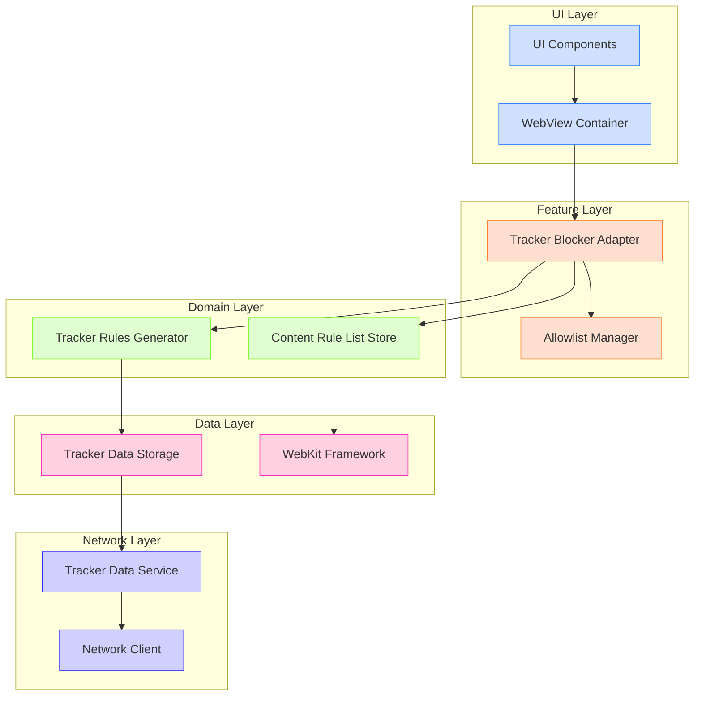

# TrackerBlockingMVP - Documentation

## Project Overview

TrackerBlockingMVP is an iOS application that provides content blocking functionality for web browsing. It uses the TrackerRadar dataset to identify and block trackers, enhancing user privacy while browsing the web.

## Architecture

The application follows a layered architecture with clear separation of concerns, adhering to SOLID principles and clean code practices.



### Architectural Choices

1. **Protocol-Oriented Design**: The project extensively uses protocols to define clear interfaces between components, enhancing testability and maintainability.

2. **Dependency Injection**: Components receive their dependencies through initialization, making the system more flexible and testable.

3. **Adapter Pattern**: The `TrackerBlockerAdapter` serves as an intermediary between the WebKit framework and our application's domain logic.

4. **Repository Pattern**: The `TrackerDataStorage` abstracts the data persistence mechanisms from the business logic.

5. **Strategy Pattern**: The content blocking strategy can be changed or modified without affecting the client code.

6. **Network Layer Abstraction**: The application uses a dedicated network layer with `TrackerDataService` to fetch updated tracker definitions from remote sources, decoupling networking logic from business logic.

### Clean Code & SOLID Principles

- **Single Responsibility Principle**: Each class has a single responsibility (e.g., `TrackerRulesGenerator` only handles rule generation).
  
- **Open/Closed Principle**: Components are open for extension but closed for modification, achieved through protocol abstractions.
  
- **Liskov Substitution Principle**: All implementations can be substituted for their abstract base types without altering correctness.
  
- **Interface Segregation Principle**: Clients only depend on methods they use, with focused protocols like `ContentBlockerProtocol` and `AllowlistManagerProtocol`.
  
- **Dependency Inversion Principle**: High-level modules depend on abstractions, not concrete implementations.

## Feature Description

### Tracker Blocking

The app blocks trackers in web content using WebKit's content blocking API. The implementation follows these steps:

1. **Tracker Data Management**: The application uses the TrackerRadar dataset to identify trackers.
   
2. **Rule Generation**: `TrackerRulesGenerator` converts tracker data into content blocking rules, taking into account user-defined allowlists.
   
3. **Rule Application**: `TrackerBlockerAdapter` compiles the rules into `WKContentRuleList` objects and applies them to WebViews.
   
4. **Allowlist Management**: Users can exempt specific domains from tracker blocking through the allowlist feature.

### Happy Path Flow

1. On initial launch or during periodic updates, the app fetches the latest TrackerRadar dataset from the remote server via the `TrackerDataService`.

2. The fetched TrackerRadar data is stored in its original format by the `TrackerDataStorage` component.

3. When a user navigates to a website in the app's WebView:
   
4. The `TrackerBlockerAdapter` checks if the domain is in the user's allowlist via the `AllowlistManager`.
   
5. If the domain is not allowlisted:
   - A deterministic identifier is generated for the content rules based on the rulesJSON string and optionally an ETag
   - The `ContentRuleListStore` checks if rules with this identifier are already compiled
   - If existing rules are found, they are applied directly to the WebView
   - If no existing rules are found, the content rules are compiled into a `WKContentRuleList`
   - The compiled rule list is then applied to the WebView, blocking trackers on the site
   
6. If the domain is allowlisted:
   - All content rule lists are removed from the WebView
   - Trackers are allowed to function on this specific domain

7. The user can toggle tracker blocking for specific sites via the allowlist manager.

## Implementation Decisions & Deviations

### Storage of Tracker Data

A notable design decision was made regarding the storage of tracker data:

- **Original Design Consideration**: Initially, there was consideration to store compiled content blocking rules in a database.

- **Implementation Decision**: Instead, I store the original TrackerRadar dataset format rather than pre-compiled rules. This approach was chosen because:
  1. TrackerRadarKit requires the original data format to properly apply allowlist exceptions
  2. Rules need to be regenerated whenever the allowlist changes
  3. WebKit's `WKContentRuleListStore` already handles caching of compiled rules
  4. This approach provides more flexibility for future extensions

This deviation from storing pre-compiled rules proved more efficient and maintainable, as it allows dynamic application of allowlists without maintaining multiple versions of compiled rules.

## Testing Strategy

The project follows a comprehensive testing strategy that includes both unit tests and integration tests.

### Unit Testing

Unit tests focus on testing individual components in isolation:

- **TrackerRulesGenerator**: Tests verify correct rule generation from tracker data.
- **AllowlistManager**: Tests ensure domains are correctly added, removed, and checked.
- **TrackerBlockerAdapter**: Tests focus on individual methods and proper delegation.

### Integration Testing

Integration tests verify the interaction between components.

#### Integration Testing Approach

The integration tests use the "System Under Test" (SUT) pattern:

1. **Protocol-Based Mocking**: Instead of subclassing difficult-to-test WebKit classes, I:
   - Created a `WebViewProtocol` that abstracts the WKWebView functionality
   - Extended WKWebView to conform to this protocol
   - Created mock implementations that implement the same protocol

2. **MakeSUT Pattern**: A helper method centralizes the creation of the system under test:
   ```swift
   private func makeSUT(url: URL? = nil, allowlistedDomains: [String] = []) -> 
     (sut: TrackerBlockerAdapter, mocks: (webView: MockWebView, 
                                         allowListManager: MockAllowlistManager, 
                                         contentRuleListStore: MockContentRuleListStore))
   ```

3. **Behavior Verification**: Tests verify that:
   - The domain is checked against the allowlist
   - Content rules are looked up, compiled, and applied as expected
   - All components interact correctly in the complete flow

This approach ensures that components work together correctly without the brittleness of testing against real WebKit classes.

## Limitations and Future Work

### Current Limitations

1. **Performance with Large Datasets**: The current implementation may experience performance issues with very large TrackerRadar datasets.

2. **Limited UI for Allowlist Management**: The allowlist management UI is minimal and could be enhanced.

3. **No Sync Between Devices**: Allowlist settings don't sync between user devices.

### Future Enhancements

1. **Performance Optimization**:
   - Implement incremental rule compilation
   - Add caching mechanisms for frequently accessed domains
   
2. **Enhanced User Controls**:
   - Granular control over tracker categories
   - Per-site blocking statistics
   
3. **Sync Capabilities**:
   - Sync allowlist settings across devices
   - Cloud backup of user preferences
   
4. **Advanced Blocking Features**:
   - Fingerprinting protection
   - First-party tracker isolation
   - Enhanced reporting features

## Conclusion

Thank you for having reviewed my code, I hope you enjoyed my design and looking forward to receive feedback.
TrackerBlockingMVP provides a solid foundation for web content tracker blocking on iOS using modern Swift programming practices and WebKit's content blocking API. The modular, protocol-oriented architecture ensures the codebase remains maintainable and testable as new features are added.
